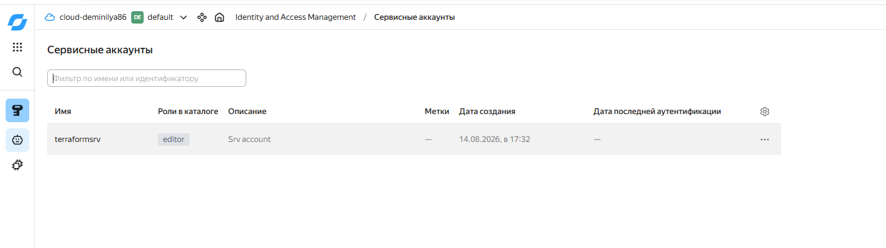
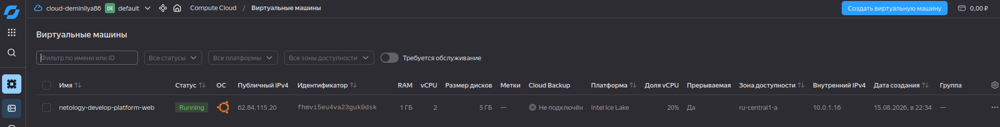
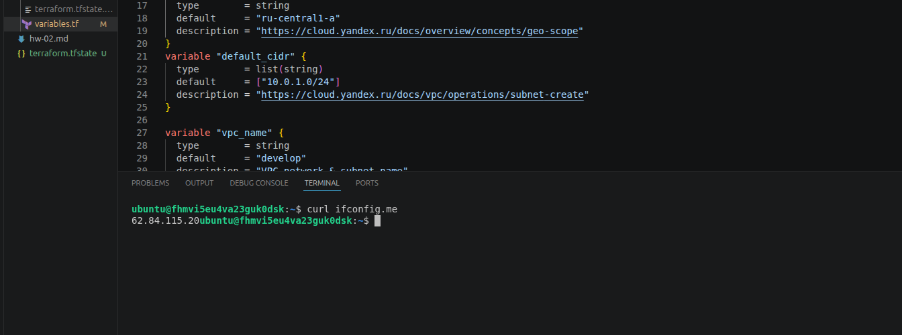
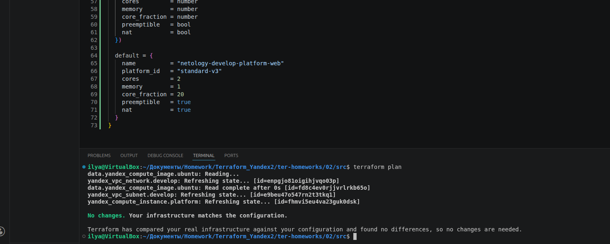
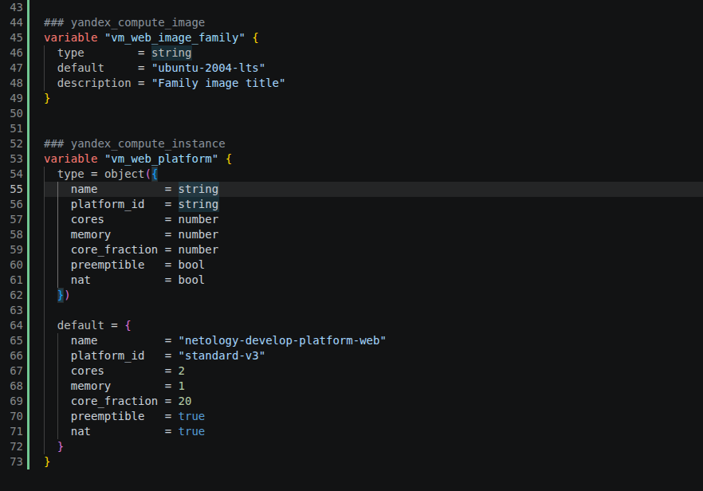
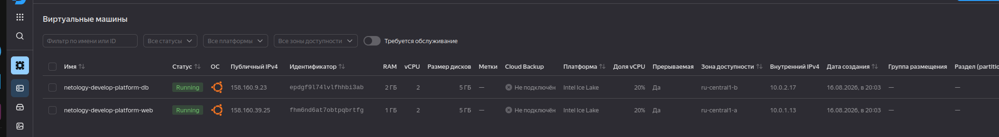
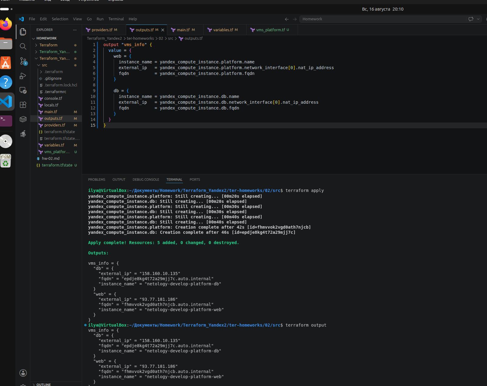
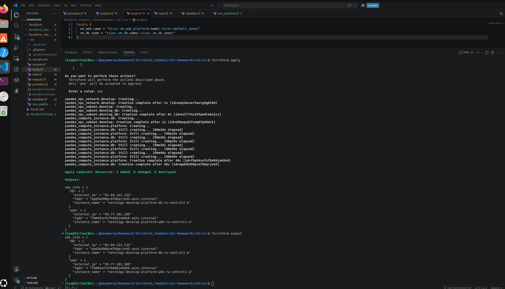
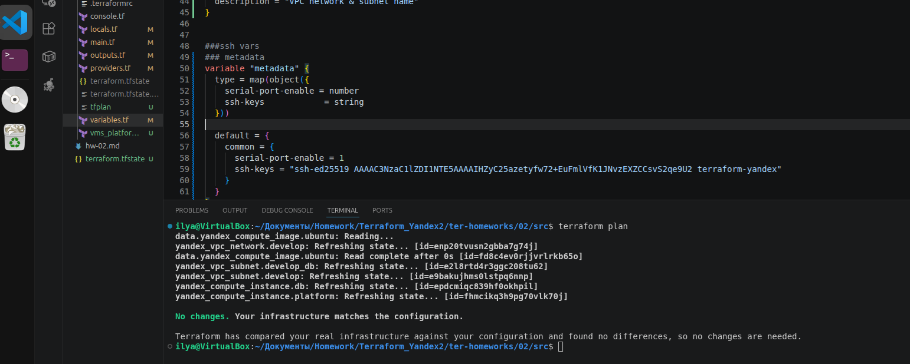
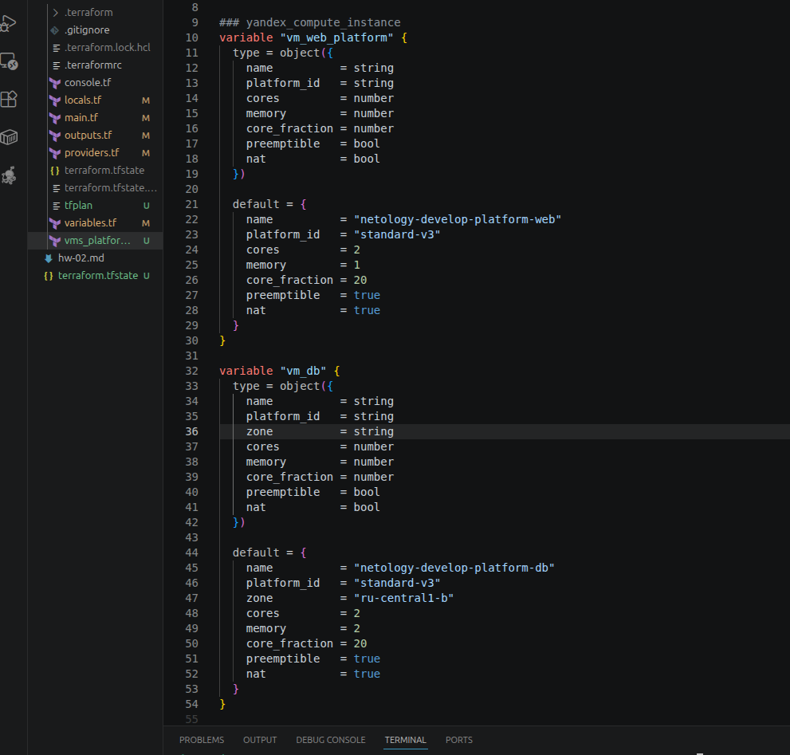

# Домашнее задание «Terraform. Yandex Cloud»

| | |
|---|---|
| **Студент** | Демин Илья Викторович |
| **GitHub репозиторий** | https://github.com/deminilyadev-maker/Homework4 |

---

# Оглавление

- [Задание 1](#задание-1)
- [Задание 2](#задание-2)
- [Задание 3](#задание-3)
- [Задание 4](#задание-4)
- [Задание 5](#задание-5)
- [Задание 6](#задание-6)

---

# Задание 1

## Шаг 1. Изучение проекта

Был изучен исходный Terraform-проект.

В файле `variables.tf` были определены переменные, необходимые для работы с Yandex Cloud.

Для работы Terraform с Yandex Cloud был использован сервисный аккаунт и его ключ.

## Шаг 2. Создание сервисного аккаунта и ключа

В Yandex Cloud был создан сервисный аккаунт и ключ сервисного аккаунта.

Полученный файл ключа использовался Terraform для аутентификации в Yandex Cloud.

### Скриншот



---

## Шаг 3. Передача публичного SSH-ключа

Публичная часть SSH-ключа была передана в переменную `vms_ssh_root_key`.

Пример:

```hcl
variable "vms_ssh_root_key" {
  type        = string
  default     = "ssh-ed25519 AAAAC3NzaC1lZDI1NTE5AAAAI... terraform-yandex"
  description = "ssh-keygen -t ed25519"
}
```

Публичный ключ используется при создании виртуальной машины для пользователя `ubuntu`.

---

## Шаг 4. Инициализация и применение Terraform

После подготовки конфигурации была выполнена инициализация:

```bash
terraform init
```

Затем применена конфигурация:

```bash
terraform apply
```

В процессе выполнения были устранены ошибки конфигурации, связанные с параметрами платформы Yandex Compute Cloud.

Для платформы допустимыми значениями `core_fraction` являются `20`, `50` и `100`, а так же `cores' должно быть кратно 2 - '2', '4' ...

В используемой конфигурации задано:

```hcl
resources {
  cores         = 2
  memory        = 1
  core_fraction = 20
}
```

---

## Шаг 5. Подключение к виртуальной машине

После создания виртуальной машины было выполнено SSH-подключение.

Для Ubuntu использовался пользователь:

```bash
ubuntu
```

Подключение выполнялось с использованием приватного SSH-ключа.

После подключения была выполнена команда:

```bash
curl ifconfig.me
```

Она возвращает внешний IP-адрес, с которого выполняется запрос.

### Скриншот





---

## Шаг 6. Параметры `preemptible` и `core_fraction`

В конфигурации виртуальной машины использовались параметры:

```hcl
scheduling_policy {
  preemptible = true
}

resources {
  core_fraction = 20
}
```

### `preemptible`

Параметр `preemptible = true` создаёт прерываемую виртуальную машину. Такая VM может быть остановлена платформой Yandex Cloud при необходимости освобождения ресурсов.

Основное преимущество — более низкая стоимость по сравнению с обычной виртуальной машиной.

Недостаток — отсутствие гарантии постоянной работы VM.

### `core_fraction`

`core_fraction` определяет гарантированную долю вычислительной мощности CPU.

В данном задании использовано:

```hcl
core_fraction = 20
```

Это соответствует 20% гарантированной вычислительной мощности vCPU.

---

# Задание 2

## Шаг 1. Вынос параметров в переменные

В соответствии с заданием хардкод-значения для `yandex_compute_image` и `yandex_compute_instance` были вынесены в отдельные переменные.

Для переменных первой виртуальной машины использован префикс:

```text
vm_web_
```

Например:

```text
vm_web_name
vm_web_platform_id
vm_web_cores
vm_web_memory
vm_web_core_fraction
vm_web_preemptible
vm_web_nat
```

Для образа Ubuntu была создана отдельная переменная:

```hcl
variable "image_family" {
  type        = string
  default     = "ubuntu-2004-lts"
  description = "Family image title"
}
```

---

## Шаг 2. Объектная переменная первой VM

Параметры первой виртуальной машины были объединены в объектную переменную.

Пример:

```hcl
variable "vm_web" {
  type = object({
    name          = string
    platform_id   = string
    zone          = string
    cores         = number
    memory        = number
    core_fraction = number
    preemptible   = bool
    nat           = bool
  })

  default = {
    name          = "netology-develop-platform-web"
    platform_id   = "standard-v3"
    zone          = "ru-central1-a"
    cores         = 2
    memory        = 1
    core_fraction = 20
    preemptible   = true
    nat           = true
  }
}
```

Параметры виртуальной машины в `main.tf` стали обращаться к переменной:

```hcl
resources {
  cores         = var.vm_web.cores
  memory        = var.vm_web.memory
  core_fraction = var.vm_web.core_fraction
}
```

---

## Шаг 3. Проверка Terraform Plan

После переработки переменных была выполнена проверка:

```bash
terraform plan
```

Изменений инфраструктуры быть не должно, так как были изменены только способы задания параметров.

### Скриншот





---

# Задание 3

## Шаг 1. Создание отдельного файла `vms_platform.tf`

В корне проекта был создан файл:

```text
vms_platform.tf
```

В него были вынесены переменные первой виртуальной машины.

---

## Шаг 2. Создание второй виртуальной машины

На основе ресурса первой VM была создана вторая виртуальная машина.

Имя второй VM:

```text
netology-develop-platform-db
```

Для второй VM использована конфигурация:

```hcl
variable "vm_db" {
  type = object({
    name          = string
    platform_id   = string
    zone          = string
    cores         = number
    memory        = number
    core_fraction = number
    preemptible   = bool
    nat           = bool
  })

  default = {
    name          = "netology-develop-platform-db"
    platform_id   = "standard-v3"
    zone          = "ru-central1-b"
    cores         = 2
    memory        = 2
    core_fraction = 20
    preemptible   = true
    nat           = true
  }
}
```

Для второй виртуальной машины задана зона:

```hcl
zone = "ru-central1-b"
```

и параметры CPU:

```hcl
cores         = 2
core_fraction = 20
```

---

## Шаг 3. Создание сети и подсетей

Для обеих виртуальных машин используется одна VPC-сеть.

```hcl
resource "yandex_vpc_network" "develop" {
  name = var.vpc_name
}
```

Для первой VM используется subnet в зоне `ru-central1-a`.

Для второй VM создан отдельный subnet в зоне `ru-central1-b`.

```hcl
resource "yandex_vpc_subnet" "develop_db" {
  name           = var.db_vpc_name
  zone           = var.db_default_zone
  network_id     = yandex_vpc_network.develop.id
  v4_cidr_blocks = var.db_default_cidr
}
```

Таким образом, обе VM находятся в одной VPC, но используют разные подсети в соответствующих зонах.

---

## Шаг 4. Подключение второй VM к DB subnet

Для второй VM используется subnet:

```hcl
network_interface {
  subnet_id = yandex_vpc_subnet.develop_db.id
  nat       = var.vm_db.nat
}
```

Зона виртуальной машины и зона subnet совпадают:

```text
VM DB       → ru-central1-b
DB subnet   → ru-central1-b
```

### Скриншот



---

# Задание 4

## Шаг 1. Создание `outputs.tf`

Для получения информации о созданных виртуальных машинах был создан файл:

```text
outputs.tf
```

В нём объявлен один общий output.

```hcl
output "vms_info" {
  value = {
    web = {
      instance_name = yandex_compute_instance.platform.name
      external_ip   = yandex_compute_instance.platform.network_interface[0].nat_ip_address
      fqdn          = yandex_compute_instance.platform.fqdn
    }

    db = {
      instance_name = yandex_compute_instance.db.name
      external_ip   = yandex_compute_instance.db.network_interface[0].nat_ip_address
      fqdn          = yandex_compute_instance.db.fqdn
    }
  }
}
```

В output для каждой VM выводятся:

- `instance_name`;
- `external_ip`;
- `fqdn`.

Значения получаются непосредственно из ресурсов Terraform, без хардкода.

---

## Шаг 2. Проверка output

После применения конфигурации была выполнена команда:

```bash
terraform output
```

### Скриншот



---

# Задание 5

## Шаг 1. Создание `locals.tf`

Для формирования имён виртуальных машин был создан отдельный файл:

```text
locals.tf
```

В одном `local`-блоке определены имена обеих VM.

Пример:

```hcl
locals {
  vm_web_name = "${var.vm_web.name}-${var.vm_web.zone}"
  vm_db_name  = "${var.vm_db.name}-${var.vm_db.zone}"
}
```

Используется интерполяция `${...}` с несколькими переменными.

Например, для первой VM:

```text
var.vm_web.name
+
var.vm_web.zone
```

формируют имя:

```text
netology-develop-platform-web-ru-central1-a
```

Для второй:

```text
netology-develop-platform-db-ru-central1-b
```

---

## Шаг 2. Использование local-переменных

В ресурсах виртуальных машин вместо непосредственного обращения к переменной имени используются созданные `local`-переменные.

Для Web VM:

```hcl
resource "yandex_compute_instance" "platform" {
  name = local.vm_web_name

  # ...
}
```

Для DB VM:

```hcl
resource "yandex_compute_instance" "db" {
  name = local.vm_db_name

  # ...
}
```

### Скриншот



---

# Задание 6

## Шаг 1. Объединение параметров VM в одну map-переменную

Для параметров вычислительных ресурсов виртуальных машин была создана единая map-переменная.

Вместо отдельных параметров:

```text
cores
memory
core_fraction
```

используется единая структура.

Пример:

```hcl
variable "vm_resources" {
  type = map(object({
    cores         = number
    memory        = number
    core_fraction = number
  }))

  default = {
    web = {
      cores         = 2
      memory        = 1
      core_fraction = 20
    }

    db = {
      cores         = 2
      memory        = 2
      core_fraction = 20
    }
  }
}
```

В ресурсах VM значения используются следующим образом.

Для Web VM:

```hcl
resources {
  cores         = var.vm_resources["web"].cores
  memory        = var.vm_resources["web"].memory
  core_fraction = var.vm_resources["web"].core_fraction
}
```

Для DB VM:

```hcl
resources {
  cores         = var.vm_resources["db"].cores
  memory        = var.vm_resources["db"].memory
  core_fraction = var.vm_resources["db"].core_fraction
}
```

---

## Шаг 2. Общая переменная `map(object)` для metadata

Для блока `metadata` создана отдельная переменная типа `map(object)`.

```hcl
variable "metadata" {
  type = map(object({
    serial-port-enable = number
    ssh-keys            = string
  }))

  default = {
    common = {
      serial-port-enable = 1
      ssh-keys            = "ubuntu:ssh-ed25519 AAAAC3NzaC1lZDI1NTE5AAAAI... terraform-yandex"
    }
  }
}
```

Обе виртуальные машины используют один и тот же объект:

```hcl
metadata = var.metadata["common"]
```

Таким образом, значения `metadata` не дублируются в каждом ресурсе VM.

---

## Шаг 3. Неиспользуемые переменные

После переработки конфигурации были проверены переменные проекта.

Переменные, которые больше не используются после объединения параметров в `vm_resources` и `metadata`, были закомментированы/удалены.

Это позволяет избежать дублирования и сохранить конфигурацию проекта в актуальном состоянии.

### Скриншоты





---

## Шаг 4. Проверка Terraform Plan

После переработки структуры переменных была выполнена проверка:

```bash
terraform plan
```

Цель проверки — убедиться, что изменение структуры Terraform-кода не приводит к изменению существующей инфраструктуры.

Ожидаемый результат:

```text
Plan: 0 to add, 0 to change, 0 to destroy.
```

Таким образом, параметры инфраструктуры были вынесены в переменные и структурированы без изменения итоговой конфигурации виртуальных машин.
